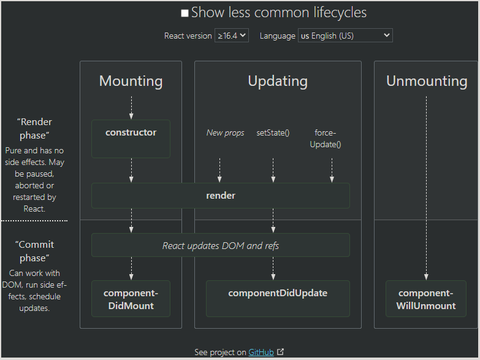

# Advanced State with Reducers  

## Review, Research, and Discussion  

1. How can we ensure that an effect hook runs only once?  
   - adding a second paramameter
```
function App() {
  useEffect(() => {
    // Run! Like go get some data from an API.
  }, []); //<-- second param
  ```
2. Can useState() update more than one state variable at the same time?  
   - No it can not.
3. Is useState() synchronous? 
   - No. I dont beleive so. It is asynchronous 

| Term                 | Definition      | 
| :-----------------:  | :-------------: | 
| State Hook           | Hooks are functions that let you “hook into” React state and lifecycle features from function components | 
| Component Lifecycle  | Each component has several “lifecycle methods” that you can override to run code at particular times in the process |   
  
  


Ref: [Run useEffect Only Once](https://css-tricks.com/run-useeffect-only-once/)  
Ref: [Common Lifecycle](https://projects.wojtekmaj.pl/react-lifecycle-methods-diagram/)  
Ref: []()  